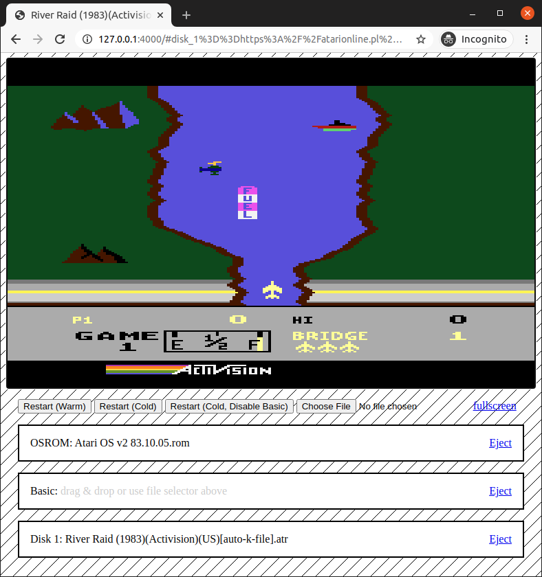

# bevy-atari - Good Enough Atari XL/XE Emulator

## Features
* It is build with Bevy Game Engine and Bevy Webgl2 plugin, compiles to WASM and works in the browser (native builds for Linux / Windows / Mac / Android / iPhone are planned too)
* uses WebGl2 for rendering and emulates ANTIC / GTIA on GPU, reducing CPU usage.
* POKEY emulation using WebAudio API
* GamePad support with Gamepad API
* Drag & Drop support for ROMs, disk images (ATRs) and XEX files (for both local files and URLs)

Few live, fully playable Atari classics:
* [Avalon Robbo (demo)](https://mrk.sed.pl/bevy-atari/#disk_1%3D%3Dhttps%3A%2F%2Fatarionline.pl%2Farch%2FR%2FRobbo%20(L.K.%20Avalon)%2FRobbo%20(demo)%20(1989)(L.K.%20Avalon)(PL).xex%7C%7Cosrom%3D%3Dhttps%3A%2F%2Fatarionline.pl%2Futils%2F9.%20ROM-y%2FSystemy%20operacyjne%2FAtari%20OS%20v2%2083.10.05.rom)
* [River Raid](https://mrk.sed.pl/bevy-atari/#disk_1%3D%3Dhttps%3A%2F%2Fatarionline.pl%2Farch%2FR%2FRiver%2520Raid%2FRiver%2520Raid%2520(1983)(Activision)(US).xex%7C%7Cosrom%3D%3Dhttps%3A%2F%2Fatarionline.pl%2Futils%2F9.%2520ROM-y%2FSystemy%2520operacyjne%2FAtari%2520OS%2520v2%252083.10.05.rom)
* [Boulder Dash](https://mrk.sed.pl/bevy-atari/#disk_1%3D%3Dhttps%3A%2F%2Fatarionline.pl%2Farch%2FB%2FBoulder%2520Dash%2520II%2FBoulder%2520Dash%2520II%2520(1985)(First%2520Star%2520Software)(US).atr%7C%7Cosrom%3D%3Dhttps%3A%2F%2Fatarionline.pl%2Futils%2F9.%2520ROM-y%2FSystemy%2520operacyjne%2FAtari%2520OS%2520v2%252083.10.05.rom)
* [Zybex](https://mrk.sed.pl/bevy-atari/#disk_1%3D%3Dhttps%3A%2F%2Fatarionline.pl%2Farch%2FZ%2FZybex%2FZybex%2520(19xx)(Callisto%2520Computers)(GB).xex%7C%7Cosrom%3D%3Dhttps%3A%2F%2Fatarionline.pl%2Futils%2F9.%2520ROM-y%2FSystemy%2520operacyjne%2FAtari%2520OS%2520v2%252083.10.05.rom)
* and many more.

## Build instructions

### Prerequisites
Install Rust: https://www.rust-lang.org/learn/get-started, then:
```
cargo install cargo-make
```
```
cargo make serve
```
and point your browser [here](http://127.0.0.1:4000/#disk_1%3D%3Dhttps%3A%2F%2Fatarionline.pl%2Farch%2FR%2FRiver%2520Raid%2FRiver%2520Raid%2520(1983)(Activision)(US).xex%7C%7Cosrom%3D%3Dhttps%3A%2F%2Fatarionline.pl%2Futils%2F9.%2520ROM-y%2FSystemy%2520operacyjne%2FAtari%2520OS%2520v2%252083.10.05.rom).
If everything went good you should see:


